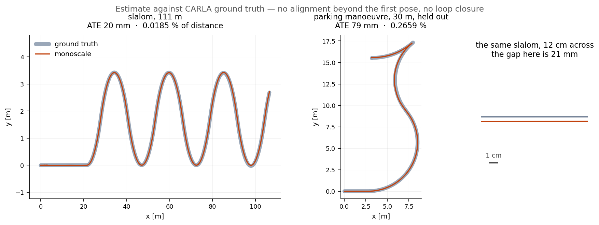
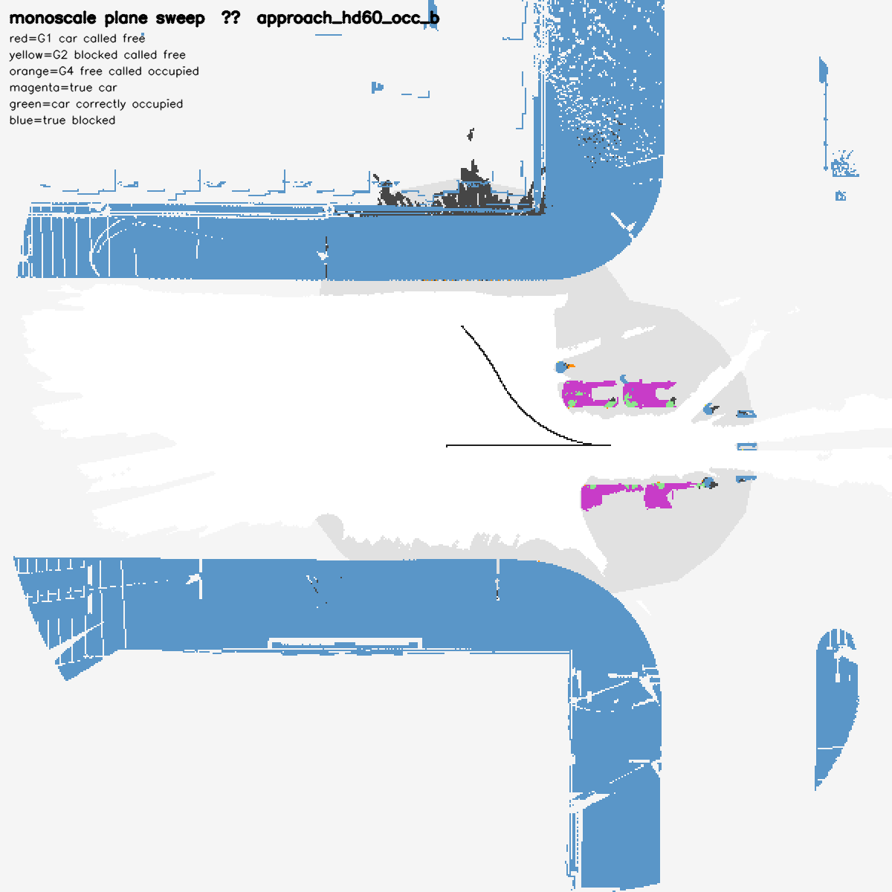

# monoscale

**Metric visual-inertial odometry whose scale comes from the ground plane**, and
an occupancy grid built from the same images. No stereo, no lidar, no learned
model, no prior map. One camera is enough, N is allowed, and they are free not
to overlap -- the two on this vehicle face opposite ways and share no field of
view at all.

On a 111 m drive in CARLA, against the ground-truth pose:

| | mean | worst |
| --- | ---: | ---: |
| **ATE / distance travelled** | **0.0237 %** | 0.0391 % |
| **final error / distance** | **0.0324 %** | 0.0627 % |
| held-out, never tuned on | **0.1781 %** | 0.2659 % |

In millimetres, because a percentage of distance is hard to feel: **26 mm of
ATE over a 111 m drive**, and 79 mm over a 30 m parking manoeuvre that no
parameter was ever chosen against.



At the scale of the drive the two lines are one. The right-hand panel zooms until the gap is visible and puts a scale bar beside it, because a figure where nothing can be seen proves nothing. Regenerate it with
`monoscale_evaluation/plot_trajectories.py <slalom_dir> <park_dir> <out.png>` from any pair of `--tum` outputs.

The held-out figure is the one to read. Two drives are kept out of every sweep
and every judgement, and they earn their place: in one week they refused four
changes that had won on the tuning set, including the removal of the last fitted
multiplier in the stack. Numbers, the set they come from and how to reproduce
them are in [`src/monoscale_evaluation/README.md`](src/monoscale_evaluation/README.md).

## What it is for

The rig is two fisheye cameras, front and rear, pitched 30 degrees down. That is
the surround-view configuration a production car already carries for parking,
and the point of taking scale from the ground plane is that **nothing has to be
added to the vehicle to make those cameras metric** -- no stereo pair, no lidar,
no HD map, no wheel encoder on the bus.

Where that matters is where GNSS does not reach and the vehicle is moving
slowly: indoor parking structures, loading yards, the last thirty metres of an
automated park. The two drives held out of every decision here are parking
manoeuvres for that reason. The accuracy of this method scales as the camera
height over the distance travelled per frame, so low and slow is the regime it
is best in, which is the opposite of what a stereo baseline prefers.

## Where the scale comes from, and what follows from it

Monocular vision has no scale. The usual sources are a second camera with a
known baseline, a lidar, or an IMU excited enough to observe it. This takes it
from the one distance a road vehicle already knows to a millimetre: **the height
of the camera above the road**. A plane-induced homography between two frames
recovers `t/h`, and `h` is the mounting height, so the answer is metric without
anything else in the vehicle measuring length.

Two properties follow, and neither is a design goal -- they are what is left
over once the scale does not come from a baseline.

**The cameras do not have to overlap, and here they cannot.** The two optical
axes point in opposite directions and each carries a 139.47 deg horizontal
field, so the front spans bearings −69.74 to +69.74 and the rear 110.27 to
249.74. That leaves **40.53 deg of gap on each side**, computable from the
configuration and not a claim: there is no shared feature anywhere, and no
baseline to triangulate on. What the second camera buys is not stereo -- it is a
nuisance that the two read with opposite sign, so averaging them cancels it.

**One camera is a rig, not a degenerate case.** With the disagreement between
two of them gone, `single_camera_variance` carries that weight instead. It
solves every drive in both sets:

| | bench mean / worst | held-out mean / worst |
| --- | ---: | ---: |
| front + rear | 0.0237 % / 0.0391 % | 0.1781 % / 0.2659 % |
| front only | 0.0621 % / 0.1265 % | 0.5689 % / 1.0588 % |
| rear only | 0.1474 % / 0.4529 % | 0.5694 % / 0.7701 % |

So one camera costs a factor of 2.6 to 6.2 and does not fall over, and the
front mount -- the lower one, which sees the ground it is about to drive over --
is the better of the two to keep. A unit test holds the floor:
`EstimatorDrive.OneCameraIsARigNotADegenerateCase`. What must not happen is that
it silently stops solving.

## What it assumes, and where it has not been tested

**The road under the cameras is locally planar.** The whole scale chain rests on
it: the homography is plane-induced, and a surface that is not a plane is model
error the four-parameter fit has to absorb. On these roads it holds to under a
millimetre over a hundred metres. On a crest, a rutted surface or a steep
camber it is the first thing that would break, and nothing here has measured
that.

**The mounting height has to be right to a millimetre.** The scale is `t/h`, so
a relative error in `h` is the same relative error in every distance: correcting
one millimetre of it moved the benchmark by half. A real vehicle's ride height
moves with load, tyre pressure and suspension travel, and none of that exists in
these recordings.

**Everything here is measured in simulation.** CARLA, one town, one weather, one
sun angle, `-quality-level=Low`. Two facts follow that a reader should have
before the numbers. The rendered road's texture is what the photometric
alignment reads, and changing the quality level alone moves the length bias by a
factor of sixty. And **the simulated IMU carries zero noise on every axis** --
accelerometer, gyro and gyro bias all set to 0.0 -- so the attitude filter, the
heading and the inertial propagation have never met a noisy one.

The heading itself is self-contained, and that is worth saying because it is the
easy thing to fake in a simulator: `imu_yaw_from_gyro` is on, so the yaw is
integrated from the gyro and its bias is corrected by the road fit's own yaw
observation. The orientation CARLA reports -- which is truth to 0.000000 deg on
these bags -- is not read. What has not been tested is that integration against
a gyro with real angle random walk.

None of that is a reason to discount the method. It is the list of things that
would have to be measured again on a vehicle, and it is written down here rather
than left for a reader to find.

## How it is built

Every constant in `vision_fisheye.param.yaml` carries the measurement that chose
it, and the measurements that rejected the alternatives. That is why the config
is 90 % comment: a value without its evidence is a value nobody can change
safely later. Ideas that were tried and lost are recorded with their numbers so
they are not tried again, and several of them were mine.

Two rules do most of the work. **Measure the quantity, do not fit the score** --
the scale correction that reads 0.1 % is derived from a millimetre of frame
geometry, not swept against ATE. And **held-out decides** -- a change that wins
on the bench and loses on the two park drives is an artefact of the bench.

Everything that runs on the vehicle is C++. The stack was developed against a
Python estimator, which was removed from the tree once the trajectories matched;
what was carried across and what was not is in
[`src/monoscale_core/README.md`](src/monoscale_core/README.md).

## Packages

| package | what it does |
| --- | --- |
| `monoscale_core` | the estimation itself. Knows nothing of ROS, so it is tested without a graph and can later share a process with a controller. |
| `monoscale_tracker` | the C++ KLT front end. Turns images into feature tracks and publishes those alone. |
| `monoscale_odometry` | the node around it, and `monoscale_replay`, which scores a bag directly. |
| `monoscale_occupancy_grid_map` | plane-sweeps the raw fisheye into an occupancy grid. CUDA for real time. |
| `monoscale_evaluation` | scoring against truth. Not deployed. |
| `monoscale_carla` | CARLA only: camera assembly, the truth tap, the drive scripts. |

## Topics

```
images ─┬─→ monoscale_tracker  →  /vision/tracks/<camera>
        │                          └→ monoscale_odometry
        │                                 ├→ /localization/kinematic_state
        │                                 └→ /perception/ground_points
        └────────────────────────→ monoscale_occupancy_grid_map
                  + camera_info               └→ /perception/occupancy_grid_map
                  + /localization/kinematic_state
```

The two branches split at the image. Odometry sees only feature tracks; the grid
looks at the raw frames again.

The grid is a **plane sweep**: world-horizontal planes are stacked from −0.15 m
in 0.05 m steps, each pixel is scored by ZNCC for how well two views agree at
each height, and SGM aggregates that into the surface height for that pixel. The
height is therefore a decision, not a by-product of triangulating features.
Attitude comes straight out of the subscribed odometry and enters the per-pixel
warp.

An earlier version accumulated the odometry's `/perception/ground_points` into
the grid. That topic is still published and the grid no longer uses it: an
obstacle that yields no corners never existed on that path, and an audit of the
depth chain found five defects, the largest of which was the warp holding pitch
and roll at zero -- 94 % of the frame-common error.

The grid is a fixed 60 x 60 m at 0.1 m, anchored to the first pose. Scored
against truth on `approach_hd60_occ_b`: G1 (calling the vehicle free) 0, G2
(calling blocked ground free) 3, G3 (cover) 0.831, G4 (false positives) 29, path
ghosts 0. A Python reference under the same conditions gives G2 2 / G3 0.829 /
G4 39, so cover and false positives are ahead here.



Four numbers are not a map, so here is the map they are scored over. White is
ground the sweep carved free, dark grey is what it called occupied, blue is
ground that truly is blocked and pale grey is never observed; the parked cars
are magenta and the parts of them the sweep found are green. The three failure
predicates have their own colours, and what the scores above say is that **there
is no red at all** -- not one cell of a vehicle was called free -- with three
yellow cells and a thin orange rim. Regenerate it with
`monoscale_evaluation/render_map.py`; the truth archives it scores against are
too large to ship, and `sim/` is what makes them.

## Building and running

```bash
source /opt/ros/humble/setup.bash
colcon build --base-paths src --symlink-install
source install/setup.bash

ros2 launch monoscale_odometry odometry.launch.py
```

Odometry needs no CUDA. `monoscale_tracker` has a GPU path for the optical flow
(`use_cuda`), built only when an OpenCV with cudaoptflow is found, and off by
default.

**The occupancy grid does need it.** The CPU sweep takes 28 minutes over 674
keyframes and cannot ship; the CUDA path takes 0.2 s per keyframe. The kernel is
`src/monoscale_occupancy_grid_map/src/sweep_kernels.cu` and CMake compiles it
when `nvcc` is present. Without `nvcc` the build quietly falls back to the CPU
path, so a successful build is not a deployable one -- check the first run for
`cuda backend: available=1`.

## Number of cameras

`camera_names` sets it. The default is the two on the vehicle.

The estimator and the tracker use different keys: the estimator reads
`camera_names`, the tracker `cameras`. The same split applies to image topics --
the estimator composes `<name>_image_topic`, the tracker reads an `image_topics`
array. In deployment `deployment.param.yaml` fills the tracker's side.

```yaml
camera_names: ['front', 'rear']       # estimator
cameras: ['front', 'rear']            # tracker
front.k: [...]                        # 3x3, row major
front.rotation_base_from_camera: [...]   # 3x3
front.translation_base_from_camera: [x, y, z]
front_image_topic: /sensing/camera/front/image_raw
```

Add a name and the same parameters are read under it; frames are gathered by
whichever combination of stamps sits closest together. There is no upper bound
and no pairing: frames are aligned by stamp, not by being a pair. One camera is
a supported configuration and costs a factor of 2.6 to 6.2 -- the table above.

## Tests

```bash
colcon test
colcon test-result --all
```

148 of them: the geometry, the anchor map, the filters, the inertial path, the
attitude, the estimator end to end over a synthetic drive, and two that hold the
vehicle's frame tree against the simulator's own calibration.

## Scoring against a recorded drive

```bash
ros2 run monoscale_odometry monoscale_replay <bag> \
  --params src/monoscale_odometry/config/vision_fisheye.param.yaml \
  --set track_topic_prefix:=/vision/tracks
```

It reads the bag itself and drives the library in recording order. It reads no
clock and no random source, so one bag gives one trajectory on a desktop and on
an Orin alike -- which is why regressions are visible at all.

## Reproducing the recordings

[`sim/`](sim/README.md) carries the conditions the bags were recorded under: the
sensor kit the odometry's extrinsics are derived from, the sensor mapping, and
the drive scripts. It is there because a millimetre of mounting height moves the
result by 0.1 %, so the calibration and the config that depends on it have to
move in one commit.
